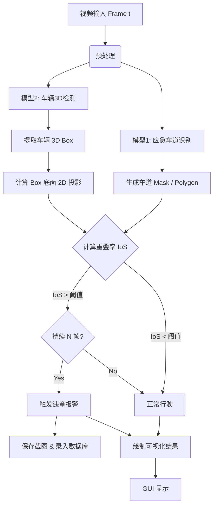

# 车辆违章识别系统（应急车道占用）设计文档

## 1. 引言 (Introduction)

### 1.1 背景
随着高速公路交通流量的增加，占用应急车道的违法行为日益频发。本项目旨在利用计算机视觉技术，基于YOLO系列算法，实现对车辆占用应急车道行为的自动识别与取证。

### 1.2 目标
开发一款桌面端软件，能够读取视频流，实时检测车辆3D位置与应急车道区域，并通过几何逻辑判断是否违章，最终输出违章车辆的抓拍图像和视频片段。

---

## 2. 系统架构设计 (System Architecture)

系统采用 **模块化分层架构**，主要分为数据层、算法层、逻辑层和表现层。

### 2.1 模块划分

1.  **输入模块 (Input Handler)**
    *   负责读取视频文件 (.mp4, .avi) 或 实时监控流 (RTSP)。
    *   负责视频帧的预处理（Resize, Normalization）。

2.  **感知模块 (Perception Engine)**
    *   **车道分割子模块**：识别画面中的应急车道区域，输出二值掩码 (Binary Mask) 或 多边形轮廓 (Polygons)。
    *   **车辆检测子模块**：基于YOLO (如 YOLOv8-3D 或 修改版 YOLO) 识别车辆，输出车辆的 3D Bounding Box (x, y, z, w, h, l, theta)。

3.  **分析模块 (Analysis Core)** - *核心逻辑*
    *   **投影变换**：将车辆3D Box的底面 4 个角点投影回 2D 图像坐标系。
    *   **几何计算**：计算“车辆底面多边形”与“应急车道掩码”的**重叠比例 (IoS)**。
    *   **状态追踪**：利用 DeepSort 或简单的质心追踪，对车辆ID进行跟踪，防止重复报警。
    *   **违章判定**：
        *   规则：若 `(Intersection Area / Vehicle Bottom Area) > Threshold (0.3)` 且 `Duration > T frames`，则判定违章。

4.  **应用模块 (Application Logic)**
    *   **日志记录**：将违章信息（时间、地点、车牌号-可选、截图路径）存入数据库。
    *   **可视化渲染**：在视频帧上绘制 3D 框、车道高亮、违章警示文字。

5.  **用户界面 (GUI)**
    *   显示实时监控画面。
    *   显示违章记录列表。
    *   系统参数设置（阈值调节、模型加载）。

---

## 3. 技术栈选型与论证 (Tech Stack)

| 组件 | 选型 | 选型原因论证 |
| :--- | :--- | :--- |
| **编程语言** | **Python 3.9+** | AI领域标准语言，拥有丰富的生态（PyTorch, OpenCV），开发效率高，便于集成现有的两个Python模型。 |
| **深度学习框架** | **PyTorch** | 你的两个现有项目大概率是基于PyTorch的。其动态图特性便于调试，且ONNX导出方便，利于后期部署加速。 |
| **GUI 框架** | **PyQt5 / PySide6** | 相比于 Web (Streamlit/Flask)，PyQt 能够开发出更专业的**桌面级应用**，支持高性能的视频绘图，且方便打包成 .exe 给用户演示。 |
| **图像处理** | **OpenCV (cv2)** | 工业级标准，处理视频流解码、图像矩阵运算（如多边形交集计算 `cv2.pointPolygonTest` 或 mask 操作）效率极高。 |
| **数据存储** | **SQLite** | 轻量级文件数据库，不需要额外部署 MySQL 服务，适合单机版桌面软件存储违章记录。 |

---

## 4. 核心算法流程图 (Algorithm Flow)



## 5. 接口设计 (Interface Design)

### 5.1 车辆对象数据结构
```python
class VehicleDetection:
    def __init__(self):
        self.id = 0          # 追踪ID
        self.cls = "car"     # 类别
        self.bbox_3d = []    # [x, y, z, w, h, l, ry]
        self.bbox_2d = []    # [xmin, ymin, xmax, ymax]
        self.bottom_corners = [] # 底面4个点在图像上的坐标 [(x1,y1), (x2,y2)...]
        self.score = 0.0     # 置信度
```

### 5.2 违章判定函数
```python
def check_violation(lane_mask, vehicle_corners, threshold=0.3):
    """
    lane_mask: 应急车道的二值图 (0, 255)
    vehicle_corners: 车辆底面多边形点集
    """
    # 1. 创建车辆底面的 Mask
    vehicle_mask = np.zeros_like(lane_mask)
    cv2.fillPoly(vehicle_mask, [vehicle_corners], 255)
    
    # 2. 计算交集 (逻辑与运算)
    intersection = cv2.bitwise_and(lane_mask, vehicle_mask)
    
    # 3. 计算面积
    inter_area = np.count_nonzero(intersection)
    vehicle_area = np.count_nonzero(vehicle_mask)
    
    if vehicle_area == 0: return False
    
    # 4. 计算侵占率
    ratio = inter_area / vehicle_area
    
    return ratio > threshold
```

## 6. 扩展功能与应用场景 (Future Works)

除了应急车道占用检测，本项目所采用的 **YOLO + 3D 目标检测** 架构还具备极强的扩展性，可应用于以下高价值违章场景。这些场景充分利用了 3D 检测提供的深度、尺寸和姿态信息。

### 6.1 车辆逆行检测 (Wrong-way Driving)
*   **原理**：3D 检测模型直接输出车辆的 **朝向角 (Yaw/Theta)**。
*   **实现**：对比“车辆朝向”与“车道规定方向”，若夹角 > 150° 即判定为逆行。
*   **优势**：相比 2D 光流法，3D 姿态判定不受车辆速度影响，静态逆行也能识别。

### 6.2 实线变道/压线检测 (Illegal Lane Change)
*   **原理**：利用 **3D 框底面** 与 **车道线** 的几何关系。
*   **实现**：判断车辆底面多边形是否与实线区域发生重叠。
*   **优势**：解决了 2D 检测中因视角倾斜或车身遮挡导致的“视觉压线”误判。

### 6.3 车辆超高/超宽检测 (Over-limit Detection)
*   **原理**：3D 检测直接输出车辆物理尺寸 **$(w, h, l)$**。
*   **实现**：设定尺寸阈值（如高度 > 4.5m），对超限车辆进行预警（适用于涵洞、桥梁保护）。
*   **优势**：单目 3D 检测虽然精度有限，但足以识别显著异常的超大型车辆。

### 6.4 违章停车检测 (Illegal Parking)
*   **原理**：结合 **3D 空间位置** + **时间阈值**。
*   **实现**：当车辆 3D 坐标位于禁停区域多边形内，且速度长期为 0 时触发。
*   **优势**：3D 空间判定比 2D 框判定更抗遮挡干扰。

## 7. 正式系统详细设计 (Formal System Design)

### 7.1 工程目录结构 (Project Structure)
为了支撑正式的桌面应用开发，建议采用以下标准目录结构：

```text
TrafficScan/
├── config/                 # 配置文件
│   └── settings.yaml       # 模型路径、阈值、摄像头地址
├── data/                   # 数据存储
│   ├── db/                 # SQLite 数据库文件
│   ├── images/             # 违章截图保存路径
│   └── videos/             # 违章视频片段
├── src/
│   ├── core/               # 核心算法 (已完成原型)
│   │   ├── lane_segmenter.py
│   │   ├── vehicle_detector_3d.py
│   │   └── violation_checker.py # 提取 main_image_test 中的逻辑
│   ├── gui/                # 用户界面 (PyQt5)
│   │   ├── main_window.py  # 主窗口
│   │   ├── components/     # UI组件 (如视频播放控件)
│   │   └── assets/         # 图标、样式表
│   ├── services/           # 业务逻辑服务
│   │   ├── video_processor.py # 视频流处理线程
│   │   └── database_manager.py # 数据库操作
│   └── main.py             # 程序入口
├── requirements.txt
└── README.md
```

### 7.2 并发架构设计 (Concurrency Architecture)
由于视频分析是计算密集型任务，严禁在 UI 线程 (Main Thread) 中运行，否则界面会“假死”。

*   **UI 线程 (Main Thread)**: 负责渲染界面、响应按钮点击、接收并显示处理后的图像。
*   **工作线程 (Worker Thread - QThread)**:
    1.  从视频源 (mp4/RTSP) 读取帧。
    2.  调用 `LaneSegmenter` 和 `VehicleDetector3D`。
    3.  执行 `check_violation` 逻辑。
    4.  通过 **Signal/Slot (信号槽)** 机制将 `(处理后的图像, 违章信息)` 发送回 UI 线程。

### 7.3 数据库设计 (Database Schema)
使用 SQLite 存储违章记录，表名: `violation_records`

| 字段名 | 类型 | 描述 |
| :--- | :--- | :--- |
| `id` | INTEGER PRIMARY KEY | 自增主键 |
| `timestamp` | DATETIME | 违章发生时间 |
| `location` | TEXT | 地点 (可配置) |
| `violation_type` | TEXT | 违章类型 (如 "Emergency Lane Occupation") |
| `image_path` | TEXT | 抓拍图片在磁盘的绝对路径 |
| `video_clip_path` | TEXT | (可选) 关联视频片段路径 |
| `is_reviewed` | BOOLEAN | 人工审核状态 (默认 False) |

### 7.4 GUI 布局规划 (Wireframe)
主界面采用 **左大右小** 的经典监控布局：

*   **顶部 (Toolbar)**: 系统设置、开始/停止检测、查看日志、模型加载状态指示灯。
*   **左侧 (Main View)**: 实时视频显示区域 (绘制了3D框和车道的高清画面)。
*   **右侧 (Sidebar)**:
    *   **实时告警面板**: 滚动显示最新的违章抓拍缩略图和时间。
    *   **统计仪表盘**: 显示今日违章总数、当前FPS。
*   **底部 (Status Bar)**: 显示当前处理进度、系统资源占用。

---

## 8. 开发计划 (Roadmap) - Updated

1.  **阶段一：模型集成 (Model Integration)**
    *   封装现有的“车道识别”代码为 `LaneDetector` 类。
    *   封装现有的“3D检测”代码为 `VehicleDetector` 类。
    *   编写测试脚本，确保两模型能同时处理同一帧图片。
2.  **阶段二：逻辑开发 (Logic Implementation)**
    *   实现底面投影与多边形交集算法。
    *   开发违章判定核心逻辑。
3.  **阶段三：UI开发 (GUI Development)**
    *   使用 PyQt5 搭建主界面。
    *   实现视频播放与实时绘制。
4.  **阶段四：测试与优化**
    *   使用测试视频集进行验证。
    *   调整阈值，优化误报率。
