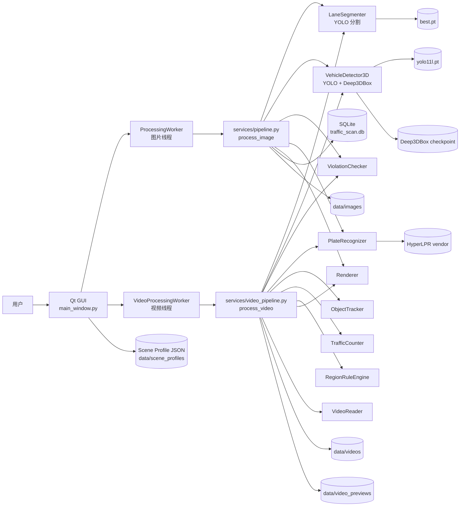
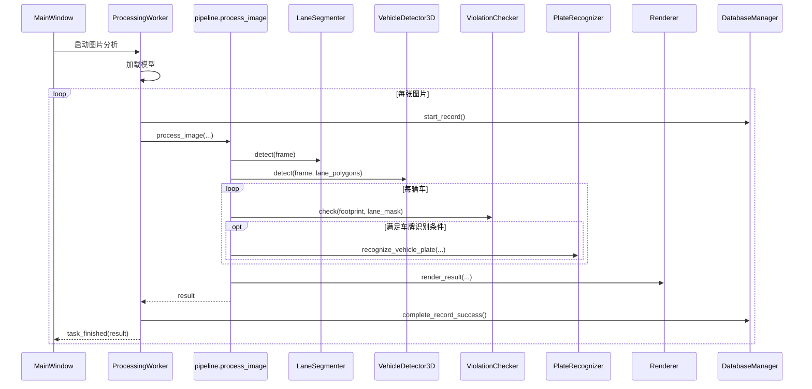
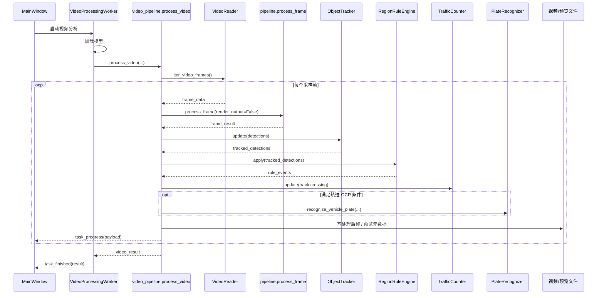
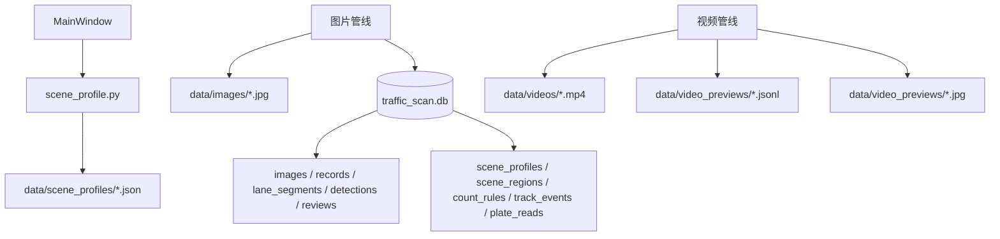

# TrafficScan_Deep3DBox_UI 系统总体架构调研

## 1. 结论先行

基于当前代码，`TrafficScan_Deep3DBox_UI` 的真实形态不是典型的“前后端分离 Web 系统”，而是一个以 **本地桌面 GUI 为壳、本地算法推理管线为核心、文件和 SQLite 为持久化载体** 的单机视觉分析系统。

它的主链路可以概括为：

1. `Qt GUI` 负责导入素材、配置区域规则、显示进度和预览结果。
2. `QThread + Worker` 负责把耗时任务从 UI 线程剥离出去。
3. `services/pipeline.py` 与 `services/video_pipeline.py` 负责组织图片和视频两条分析链路。
4. `core/` 下的检测、3D 框恢复、违章判定、跟踪、计数、车牌识别等模块负责算法执行。
5. `services/renderer.py` 负责结果叠加渲染。
6. 输出结果分别写入：
   - 图片结果和结构化记录：`data/images` + `data/db/traffic_scan.db`
   - 视频结果和预览元数据：`data/videos` + `data/video_previews`
   - 场景区域与计数线配置：`data/scene_profiles/*.json`

## 2. 系统定位

### 2.1 运行形态

- 启动入口是桌面程序，不是 HTTP 服务。
- GUI 入口在 `src/run_gui_auto_batch.py` 和 `src/gui/app.py`。
- 主窗口编排在 `src/gui/main_window.py`。
- 图片和视频分析都由本地线程直接调用本地模型，不经过远程推理服务。

### 2.2 当前架构特征

- **单进程桌面应用**
  UI、任务调度、算法推理、结果预览都在同一个应用内完成。
- **双主流程**
  图片走 `process_image`，视频走 `process_video`。
- **弱后端、强本地处理**
  没有独立 API 服务、任务队列、中间件或云端模型服务。
- **混合持久化**
  一部分数据写入 SQLite，一部分写入 JSON/图片/视频文件。

## 3. 分层架构

### 3.1 分层说明

| 层级 | 主要模块 | 职责 |
| --- | --- | --- |
| 表现层 | `src/gui/*` | 素材导入、工作区管理、预览、ROI 编辑、区域规则开关、视频播放、进度反馈 |
| 调度层 | `ProcessingWorker`、`VideoProcessingWorker` | 模型初始化、线程内执行、停止控制、进度与结果信号回传 |
| 服务编排层 | `services/pipeline.py`、`services/video_pipeline.py` | 组织图像/视频处理步骤，串联算法模块，生成统一结果结构 |
| 核心算法层 | `core/lane_segmenter.py`、`core/vehicle_detector_deep3dbox.py`、`core/violation_checker.py`、`core/object_tracker.py`、`core/traffic_counter.py`、`core/plate_recognizer.py` | 分割、检测、3D 框恢复、违章判定、时序跟踪、过线统计、车牌识别 |
| 规则层 | `services/region_rule_engine.py` | 基于区域配置扩展禁停、禁非机动车、禁逆行等规则 |
| 渲染与媒体层 | `services/renderer.py`、`services/video_reader.py` | 检测结果可视化、视频按帧读取与预览 |
| 持久化层 | `services/database_manager.py`、`services/scene_profile.py`、`services/sequence_schema.py` | 图片结果入库、场景配置保存、数据库表结构准备 |

### 3.2 总体组件图

## 4. 核心模块关系

### 4.1 GUI 层

`src/gui/main_window.py` 是系统编排中心，负责：

- 管理工作区素材列表
- 区分图片和视频两类运行模式
- 维护分析结果缓存 `_results_by_path`
- 读取和保存场景配置 `scene_profile`
- 把手动画定的区域、方向线、计数线传给视频管线
- 接收 Worker 的进度、完成、失败信号并更新界面

其中：

- 左侧 `workspace_panel.py` 负责素材导入和状态显示
- 中间 `viewer_panel.py` 负责图片/视频预览、图层开关、ROI 编辑
- 右侧 `violations_table.py` 实际上承担“区域规则面板 + 结果摘要”的角色

### 4.2 调度层

Worker 分成两类：

- `src/gui/processing_worker.py`
  负责图片批处理，并在成功后调用 `DatabaseManager` 写入 SQLite。
- `src/gui/video_processing_worker.py`
  负责视频批处理，实时回传进度，但当前没有把视频结果持久化进 SQLite。

这是当前系统一个很重要的架构事实：**图片结果有数据库落盘，视频结果主要以文件和内存结果对象存在。**

### 4.3 服务编排层

#### 图片管线

`services/pipeline.py` 的 `process_frame`/`process_image` 负责：

1. 取得车道区域
2. 运行 3D 车辆检测
3. 计算车辆 footprint 与车道 mask 的重叠比例
4. 选择性执行车牌识别
5. 组装结构化 `detections`
6. 渲染叠加图
7. 保存处理后图片

#### 视频管线

`services/video_pipeline.py` 比图片管线多了时序能力：

1. 逐帧读取视频
2. 对每一帧复用 `process_frame`
3. 对帧间目标做 `ObjectTracker.update`
4. 对轨迹应用 `RegionRuleEngine.apply`
5. 基于轨迹穿越关系做 `TrafficCounter.update`
6. 在需要时做轨迹级车牌 OCR 聚合
7. 渲染视频输出
8. 写出预览帧与 `jsonl` 元数据
9. 汇总成视频级结果

## 5. 图片处理时序图

## 6. 视频处理时序图

## 7. 数据与配置架构

### 7.1 模型资源

- 车道分割模型：`src/models/best.pt`
- 车辆 2D 检测模型：`src/models/yolo11l.pt`
- Deep3DBox 权重：`external/deep3dbox_demo_model/demo_model`
- 车牌识别依赖：`experiments/license_plate_poc/vendor`

### 7.2 持久化对象

| 类型 | 位置 | 用途 |
| --- | --- | --- |
| 处理后图片 | `data/images` | 图片结果可视化输出 |
| 处理后视频 | `data/videos` | 视频结果输出 |
| 视频预览帧与 JSONL | `data/video_previews` | GUI 交互式视频预览 |
| SQLite 数据库 | `data/db/traffic_scan.db` | 图片处理记录、检测结果、兼容后续序列表 |
| 场景配置 JSON | `data/scene_profiles/*.json` | 区域、多边形、方向线、计数线配置 |

### 7.3 数据存储现状图

注意：

- `sequence_schema.py` 已经为视频时序结果预留了表结构。
- 但当前代码中，`scene_profile` 仍主要保存为 JSON 文件。
- `track_events`、`plate_reads` 等序列表目前更多是“数据库设计已准备”，还不是现行主落盘路径。

## 8. 核心算法架构理解

### 8.1 车辆检测与 3D 框恢复

`core/vehicle_detector_deep3dbox.py` 当前采用的是：

- `Ultralytics YOLO` 负责 2D 目标检测
- `TensorFlow v1 + tf_slim` 版 Deep3DBox 负责方向与尺寸估计
- 基于投影矩阵和几何求解恢复 3D 位置与 2D 投影角点

所以它本质上是一个 **YOLO 负责找车，Deep3DBox 负责补 3D 几何** 的组合式检测器。

### 8.2 违章判定

`core/violation_checker.py` 的核心逻辑很直接：

- 将车辆 footprint 填成 mask
- 与车道 mask 求交集
- 以交并比例阈值判断是否占用应急车道

这意味着当前“应急车道占用”规则属于 **单帧空间关系判定**。

### 8.3 视频扩展规则

视频场景中新增了两个维度：

- **时序维度**
  通过 `ObjectTracker` 把单帧检测连成轨迹。
- **区域规则维度**
  通过 `RegionRuleEngine` 在指定区域上扩展：
  - 禁停
  - 禁非机动车
  - 禁逆行

因此视频管线已经从“单帧检测系统”演进为“带时序行为分析的规则引擎系统”。

## 9. 当前架构优点

### 9.1 优点

- 模块边界已经比较清楚，GUI、管线、算法、规则、存储基本分层。
- 图片和视频共用 `process_frame`，减少了重复实现。
- 视频管线已经具备轨迹、计数、区域规则、OCR 聚合等扩展点。
- `scene_profile` 让固定机位下的区域配置可复用。
- Worker + QThread 让界面与耗时推理解耦。

## 10. 当前架构的边界与不足

### 10.1 明显边界

- 这是本地单机系统，不适合直接承载多人协同或服务化部署。
- 模型加载发生在 Worker 内，适合单机批处理，不适合高并发服务。
- 当前没有统一的“领域结果总线”或标准事件模型，图片和视频结果结构存在差异。

### 10.2 目前最值得注意的不足

1. **视频结果尚未形成完整数据库闭环**
   图片会入库，视频主要落文件和 UI 内存对象，后续做检索、复核、统计会受限。
2. **场景配置以 JSON 为主，数据库表与运行态未完全统一**
   `scene_profiles` 等表已准备，但当前主路径仍是 `data/scene_profiles/*.json`。
3. **算法执行仍是强耦合本地调用**
   若未来要做 Web 化、服务化或多机部署，需要先把推理服务抽离。
4. **主窗口承担了较多编排职责**
   `main_window.py` 既管 UI，又管运行态缓存、配置映射、任务编排，后期继续扩展时维护成本会升高。

## 11. 如果把它用于论文/汇报，建议这样描述

可以把系统总体架构概括为四层：

1. **表现层**
   基于 Qt 的桌面交互界面，负责素材管理、区域编辑、结果展示与任务控制。
2. **业务编排层**
   基于 Worker 和服务管线完成图片/视频分析任务调度。
3. **算法分析层**
   集成车道分割、YOLO 检测、Deep3DBox 3D 几何恢复、违章判定、目标跟踪、区域规则和车牌识别。
4. **数据持久化层**
   通过 SQLite、JSON、图片和视频文件保存结构化结果与可视化证据。

一句话版本：

> 该系统是一个面向固定机场景交通违章识别的桌面式本地智能分析平台，采用“Qt 界面 + 线程化任务调度 + 图像/视频分析管线 + 混合持久化存储”的总体架构。

