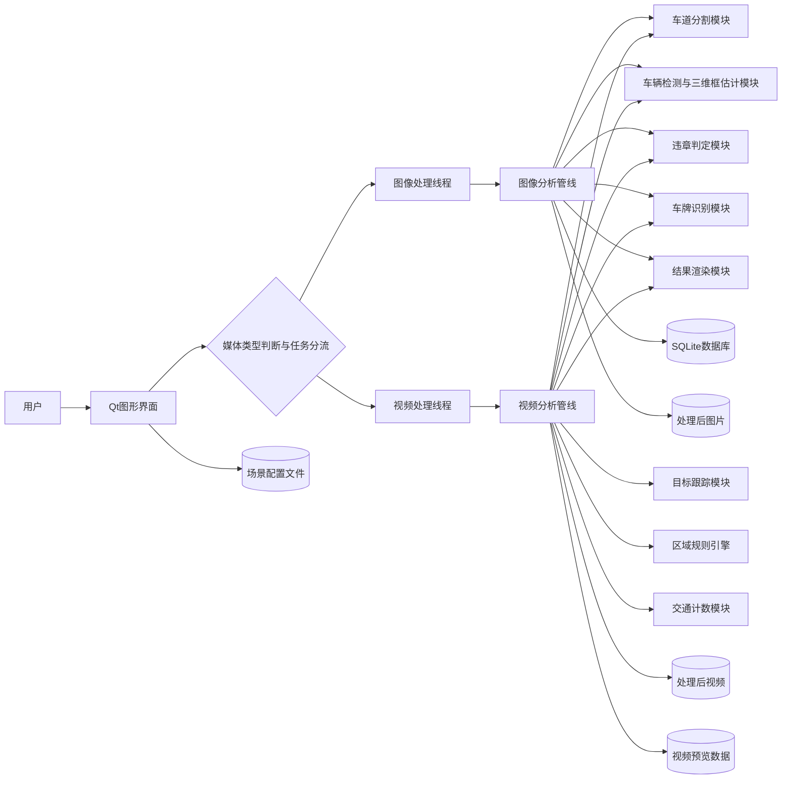
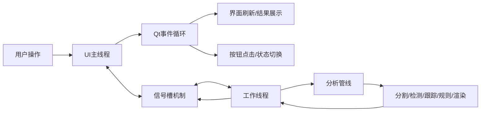
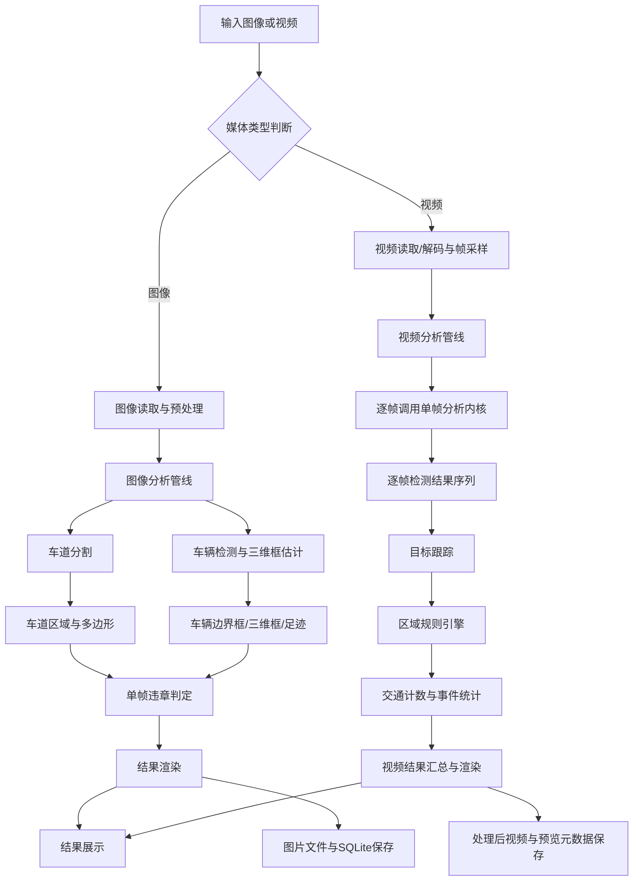
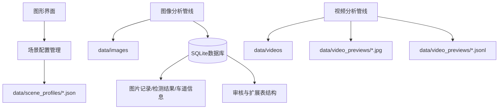

## 第4章 系统总体设计

### 4.1 系统总体架构

本系统面向固定机场景下的车辆违章识别任务，采用“桌面端交互界面 + 本地智能分析管线 + 混合持久化存储”的总体设计思路。与传统前后端分离式系统不同，本系统以 Qt 图形界面作为主要交互入口，在单机环境中完成素材导入、参数配置、任务调度、结果展示与数据保存等功能。该设计既能够满足毕业设计阶段对系统完整性和可演示性的要求，又能够降低系统部署复杂度，便于在普通开发环境中完成调试与验证。

从功能结构上看，系统可划分为表现层、任务调度层、服务编排层、算法分析层和数据持久化层五个层次。其中，表现层负责用户交互与结果展示；任务调度层负责将图像分析和视频分析任务从界面线程中解耦，避免界面阻塞；服务编排层负责组织各类分析步骤并统一输入输出结构；算法分析层负责车道分割、车辆检测、三维框估计、轨迹跟踪、规则判定与车牌识别等核心功能；数据持久化层负责处理结果、场景配置及结构化记录的保存。通过上述分层设计，系统各模块之间形成了较清晰的职责边界，从而提高了整体系统的可维护性与可扩展性。

如图4-1所示，用户首先通过桌面图形界面导入图片或视频素材，并在需要时配置区域、方向线和计数线等场景信息。系统会先依据文件后缀完成媒体类型识别，并在任务启动阶段执行任务分流：图像素材进入图像处理线程，视频素材进入视频处理线程；若同时选中图像和视频，系统不执行混合分析，而是要求分别运行。在线程内部，服务编排模块再分别调用图像分析管线或视频分析管线，最终将处理结果输出到图片文件、视频文件、场景配置文件或 SQLite 数据库中，形成较完整的端到端闭环。

图4-1 系统总体架构图

### 4.2 并发架构与线程模型设计

本系统在运行时采用单进程多线程架构。整个程序作为一个桌面端应用进程运行，其中主线程负责 Qt 图形界面的事件循环、控件刷新、用户交互响应和结果展示，工作线程负责图像或视频分析任务的执行。通过将耗时计算从界面主线程中剥离，系统能够避免在模型推理和数据处理中出现界面阻塞，从而提升交互流畅性和系统可用性。

在具体实现上，系统通过 `QThread` 与 Worker 对象相结合的方式构建任务调度机制。图像分析任务由图像处理工作线程执行，视频分析任务由视频处理工作线程执行。工作线程内部进一步调用车道分割、车辆检测、三维框估计、目标跟踪、规则判定和结果渲染等模块，而主线程仅负责接收工作线程返回的进度信息与处理结果，并更新界面显示。线程之间主要通过 Qt 的信号与槽机制进行通信，从而降低线程间直接共享状态所带来的复杂性。

需要说明的是，Python 运行环境中的全局解释器锁(GIL)会限制同一进程内多个线程同时执行纯 Python 字节码，因此该线程模型的主要目标并不是提升纯 Python 计算的并行速度，而是实现界面线程与分析线程的职责解耦。与此同时，本系统中的大量计算过程依赖 OpenCV、NumPy、PyTorch 和 TensorFlow 等底层库完成，这些库中的核心计算通常在 C/C++ 或 GPU 环境中执行，因此该多线程设计在实际工程中仍然能够有效支撑界面响应与后台分析并行推进。

从界面运行机制看，用户点击按钮、进度条更新和预览刷新等动作虽然都发生在主线程中，但并不是同时执行的。Qt 采用事件循环机制统一调度界面事件，主线程会将按钮点击、界面重绘、进度更新等请求组织为事件队列，再由事件循环按顺序依次处理。这样一来，即使后台工作线程持续执行分析任务，主线程仍能够及时响应用户操作并刷新界面状态，从而保持较好的交互体验。

如图4-2所示，系统在并发架构上可以概括为“主线程负责界面，工作线程负责分析，线程间通过信号槽传递状态”的结构。该设计既符合 Qt 桌面应用的常见工程模式，也适合当前单机智能分析系统的实现需求。

图4-2 线程示意图

### 4.3 功能模块划分

为满足图像分析、视频分析和规则配置等多类需求，系统在工程实现上将功能划分为若干相对独立的模块，各模块之间通过统一的数据结构进行交互。

1. 表现层模块。该部分主要由工作区面板、图像/视频预览面板和规则配置面板组成。工作区面板负责素材导入、列表展示和任务状态显示；预览面板负责显示原始图片、处理结果以及视频播放内容；规则配置面板负责区域规则开关、方向线设置和结果详情展示。表现层既承担用户交互功能，也负责将运行结果以可视化方式反馈给用户。

2. 任务调度模块。该模块通过独立工作线程执行图像与视频分析任务，主要目的是避免耗时计算阻塞主界面。图像分析线程负责批量图片处理以及图片结果入库，视频分析线程负责逐帧分析、进度回传和视频级结果汇总。该设计体现了界面线程与计算线程分离的并发思想。

3. 服务编排模块。系统分别设置图像分析管线与视频分析管线，用于统一组织输入读取、模型调用、结构化结果生成和可视化输出。图像管线适用于单帧场景，直接面向单张图片完成分析；视频管线面向连续帧序列，除媒体读取和结果写出流程不同外，还在逐帧处理中复用了底层单帧分析能力，并进一步增加了目标跟踪、轨迹级车牌聚合、区域事件统计和计数逻辑等时序处理步骤。

4. 核心算法模块。该部分是系统的关键组成，主要包括车道分割模块、车辆检测与三维框估计模块、违章判定模块、目标跟踪模块、交通计数模块、区域规则引擎模块和车牌识别模块。各模块共同构成了从视觉感知到行为理解的完整分析链路。

5. 数据持久化模块。系统采用文件存储与数据库存储相结合的方式保存运行结果。图片处理结果以图片文件和 SQLite 记录形式保存；视频处理结果以处理后视频文件、预览帧文件和预览元数据形式保存；区域和计数线等场景信息则以 JSON 配置文件形式保存。该设计兼顾了轻量化、可追溯性和工程实用性。

### 4.4 数据流与处理流程设计

系统在处理流程上同时支持图像和视频两类输入，但两者并不是先进入同一条完整业务管线、再在末端判断输入类型。实际实现中，系统会先在任务调度层完成媒体类型识别与任务分流：图像进入图像处理管线，视频进入视频处理管线。对于图像输入，系统主要关注单帧内的车道区域提取、车辆检测、三维几何恢复与占道判定；对于视频输入，系统则在逐帧分析基础上增加时间维度建模，从而进一步支持目标跟踪、禁停判定、逆行检测与交通计数等时序行为识别任务。

如图4-3所示，输入数据在进入分析阶段之前首先执行媒体类型判断。图像分支完成图像读取与预处理后，进入单帧图像分析流程，依次执行车道分割、车辆检测与三维框估计、单帧违章判定和结果渲染，并将结果写入图片文件和 SQLite 数据库。视频分支完成视频读取、解码与帧采样后，进入视频分析流程；该流程会对每一帧复用底层单帧分析内核，得到逐帧检测结果序列，再进一步执行目标跟踪、区域规则引擎、交通计数与事件统计，最终生成视频级汇总结果并输出处理后视频及预览元数据。

上述流程的优势在于：一方面，图像与视频在业务入口和输出形态上保持分离，能够保证两类任务调度与结果组织的清晰性；另一方面，视频管线在逐帧处理阶段复用了底层单帧分析内核，避免了重复开发，并在其上自然叠加时序逻辑，使系统能够较平滑地从静态识别扩展到动态行为分析。

图4-3 系统数据流与处理流程图

### 4.5 数据存储与配置组织

为保证系统结果具备可追溯性与可复现性，本系统采用混合持久化存储策略。不同类型的数据根据访问频率、结构特征和后续用途，被保存到不同介质中。具体而言，图像处理结果主要写入处理后图片目录和 SQLite 数据库；视频处理结果主要写入处理后视频目录和预览数据目录；场景区域、方向线和计数线等配置数据则保存为 JSON 文件，供后续重复加载与规则复用。

这种设计方式具有两方面优势。其一，结构化结果保存到数据库后，便于后续统计查询、人工复核和实验分析；其二，预览帧、结果图片和视频等可视化证据直接以文件形式保存，便于界面快速调用和答辩展示。在当前毕业设计阶段，该方式相较于引入独立服务器和复杂数据库系统，更符合单机应用的实现条件与使用需求。

如图4-4所示，系统中的场景配置由界面层生成并写入场景配置文件，图像分析结果同时写入结果图片目录和 SQLite 数据库，视频分析结果则写入处理后视频、预览图片和元数据文件。这样既形成了清晰的数据流向，也保证了不同类型数据的职责分离。

图4-4 系统数据存储结构图

### 4.6 本章小结

本章从总体架构、线程模型、功能模块、处理流程与数据组织五个方面对系统进行了整体设计说明。系统采用分层化与模块化相结合的设计方式，以 Qt 桌面界面为交互入口，以本地线程化分析管线为执行核心，以车道分割、车辆检测、三维框估计、目标跟踪和规则引擎为主要算法支撑，并通过文件系统与 SQLite 数据库完成结果持久化。新增的并发架构设计进一步说明了系统在单进程多线程条件下如何实现界面响应与后台分析解耦，为后续关键算法实现、系统功能开发和实验测试奠定了结构基础。
